# Vision-Modules
Collection of Vision Tools and Related Stuff to Handle Vision Part of the Robot
## Current Vision Modules
* Convex Hull
  * [ ] on Image
  * [ ] on Points
* Image Processing
  * [ ] Gaussian Blur and Kernels
  * [ ] Bit Plane and Binary Image
  * [ ] Canny Edge Detection
  * [ ] Grayscale
  * [ ] Treshold
  * [ ] Sobel
* Detection Model Handler
  * [ ] Detection Model
  * [ ] Logger
  * [ ] Tools
## Overview
Implement Convex Hull Graham's Scan and Gift Wrapping Algorithms on 2D Points and Images, 2D Point has only X-Axis, Y-Axis and Theta (Between 2 Points) Values, on Image You Must Implement Convex Hull Algorithms on Segmented Images that are Stored in [Assets Directory](Assets)

You May Need Fast Sort Algorithm for Image Size of 320 x 240, So Test These Sort Methods for Your Convex Hull Implementation :
* Insertion Sort
* Selection Sort
* Bubble Sort
* Merge Sort
* Quick Sort

## Convex Hull
Example of Convex Hull on Random Generated 2D Points :
<p align="center">
  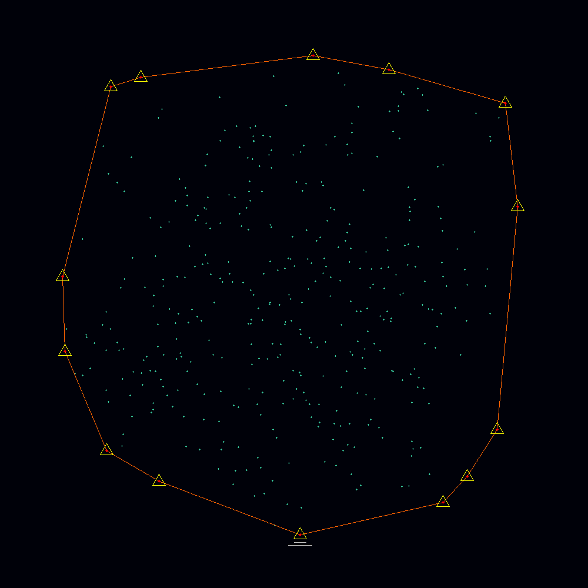
</p>

Example of Segmented Images in [Assets](Assets) Directory :
<div align="center">
  <div style="display: flex; flex-wrap: wrap; justify-content: center;">
    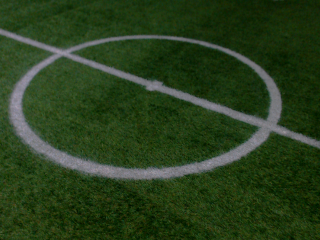
    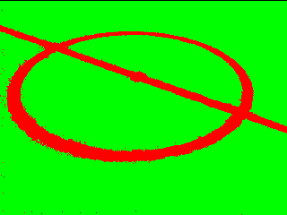
    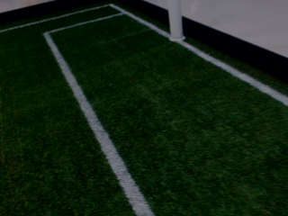
    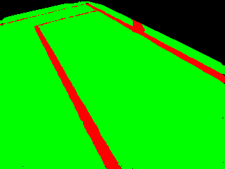
  </div>
</div>

## Image Processing
Implement Image Processing Filters on [This](Assets/juniors.png) Image
Sample Filtered Image :
<div align="center">
  <div style="display: flex; flex-wrap: wrap; justify-content: center;">
    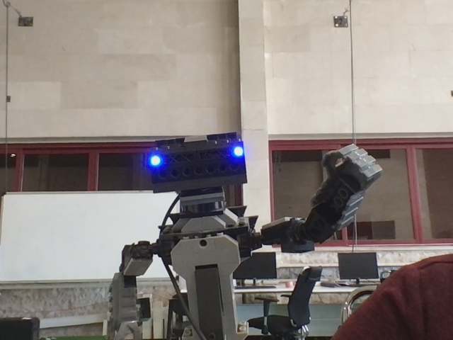
    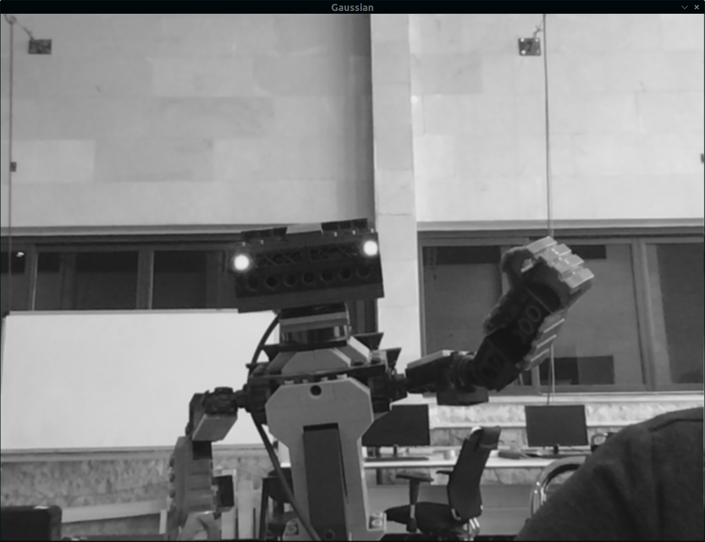
    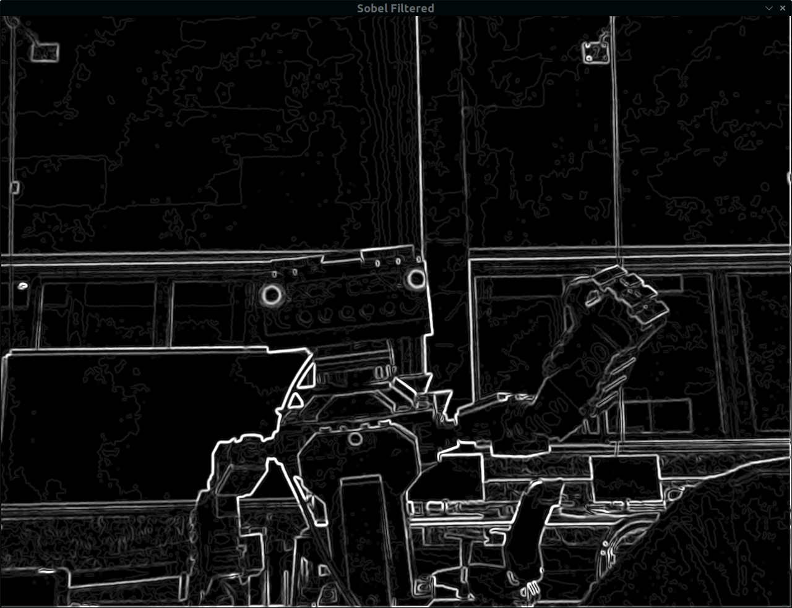
    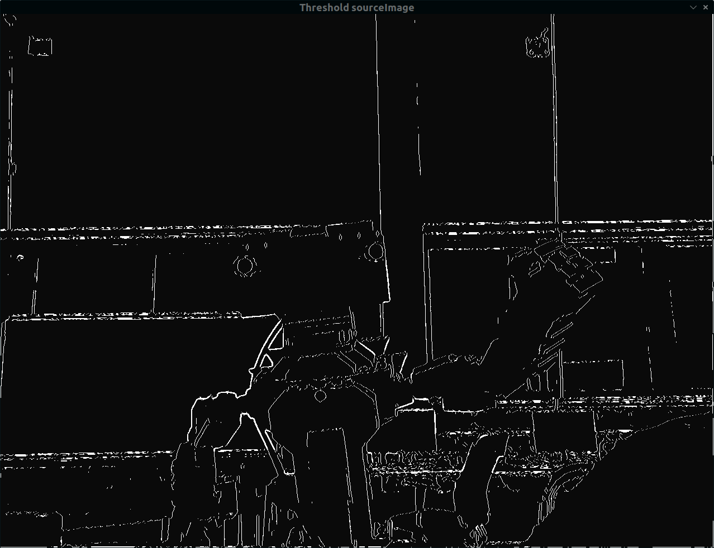
    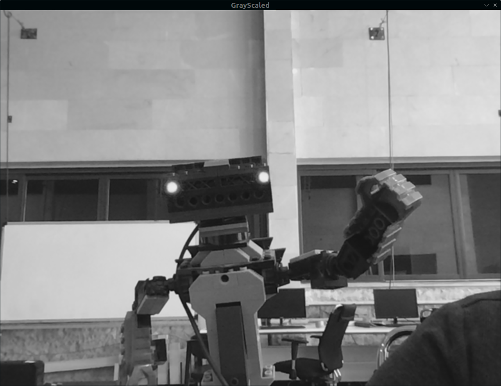
    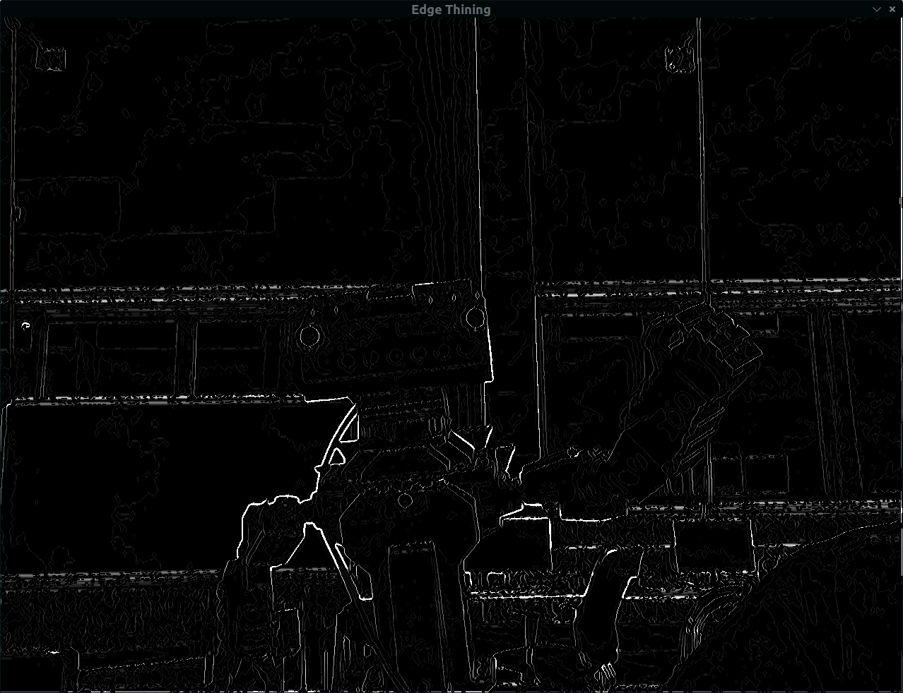
  </div>
</div>

## Build and Execute
```bash
# - Clone the Repository
git clone https://github.com/MRL-HSL-Software/Vision-Modules.git
cd Vision-Modules/

# - Also Clone MRL HSL CMake Project
git clone https://github.com/MRL-HSL-Software/MRL-HSL-CMake.git
cd MRL-HSL-CMake/

# - Build Project Project Using This Command :
./setup.sh

# - To Run Output Go to build Directory and Then Enter This Command :
./run
```
